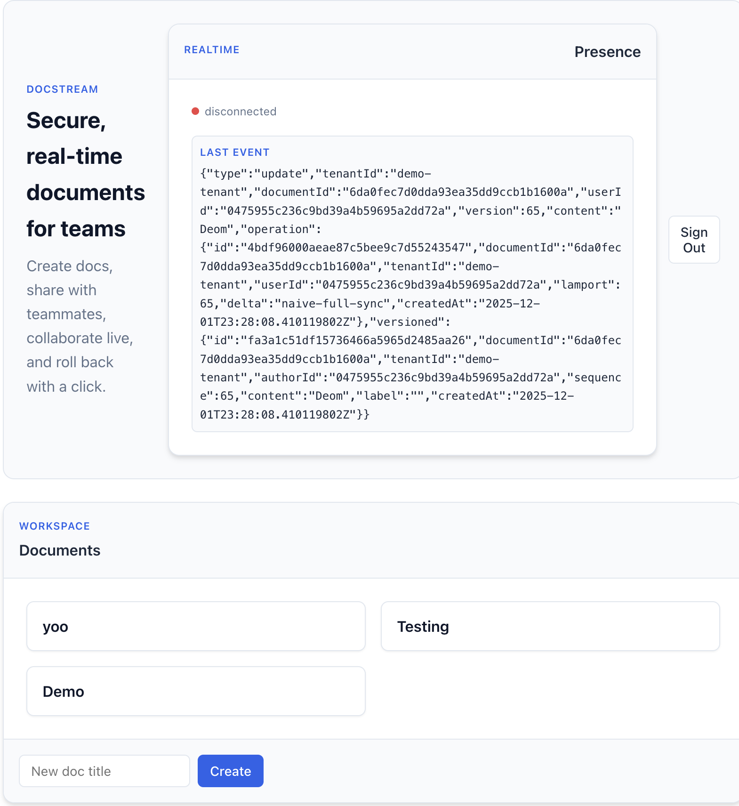
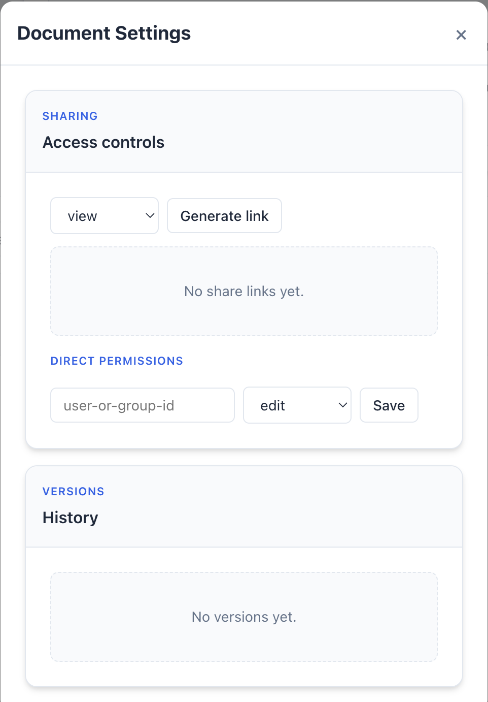

# DocStream

DocStream is a real-time collaborative document editing platform designed for teams to work together on shared text simultaneously. It supports multi-user editing, live presence indicators, and secure sharing controls within isolated workspaces.

<p align="center">
  <video src="images/demoVideo.mp4" controls width="100%">
    Your browser cannot play this video. Download it instead.
  </video>
</p>

<table>
  <tr>
    <td align="center">
      <br/>
      <sub>Workspace: organize docs and jump into live editing.</sub>
    </td>
    <td align="center">
      <br/>
      <sub>Share menu: set view/comment/edit access or create expiring links.</sub>
    </td>
  </tr>
</table>

## System Overview

The project is built to explore real-time synchronization patterns and efficient full-stack architecture:

- **Backend (Go):** A high-performance server handles WebSocket connections for real-time events. It manages a "Hub" and "Room" pattern to broadcast operations (typing, cursor movements) to connected clients efficiently. It ensures concurrency safety using channels and mutexes rather than heavy locking on the database.
- **Frontend (React + Vite):** The client maintains a local state of the document and synchronizes with the server via a custom hook. It handles optimistic UI updates to ensure typing feels instant, even when network latency varies.
- **Data Storage (Postgres):** While the editing session is in-memory and ephemeral for speed, document snapshots and version history are reliably persisted to PostgreSQL.
- **Containerization:** The entire stack (Backend, Frontend, Database) is containerized with Docker for consistent deployment and easy local setup.

## Key Features

- **Real-Time Collaboration:** Multiple users can edit the same document at once. Changes are propagated instantly via WebSockets.
- **Presence:** See who else is currently viewing or editing the document.
- **Version Control:** Documents are versioned, allowing users to revert to previous states.
- **Access Control:** Granular sharing permissions (Viewer, Commenter, Editor) and support for expiring share links.
- **Workspace Isolation:** Data is segmented by "tenants" or workspaces to ensure privacy and organization.

## Getting Started

### Prerequisites
- Docker and Docker Compose

### Running Locally
1. Start the services:
   ```bash
   docker-compose up --build
   ```
### Development
- **Backend:** Written in Go (`/backend`). Standard `go run` or `air` for hot reload if configured.
- **Frontend:** React application (`/frontend`). Run `npm run dev` for the Vite development server.

